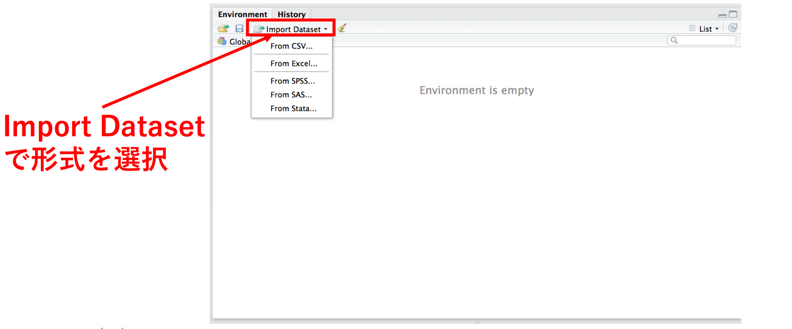
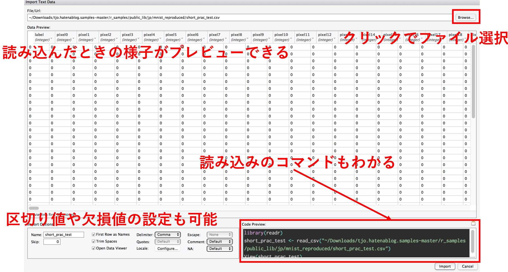
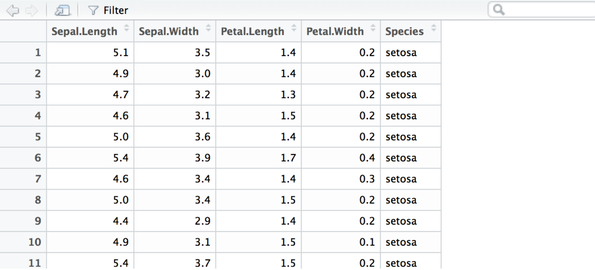
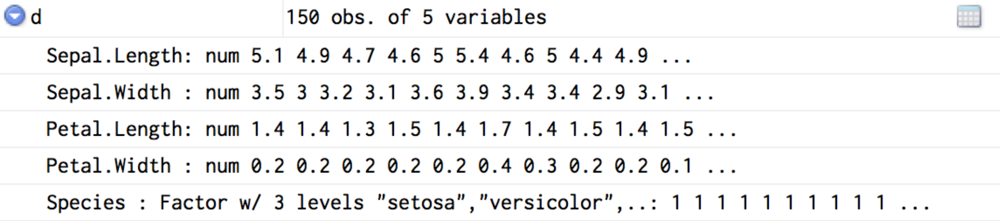

```{r eval=TRUE, echo=FALSE, warning=FALSE, message=FALSE, comment=""}
knitr::opts_chunk$set(echo = TRUE,
                      eval = TRUE,
                      warning = FALSE,
                      message = FALSE,
                      comment = "",
                      fig.height = 7,
                      fig.width = 7,
                      out.height = 400,
                      out.width = 400)
```

```{css}
/* echo=true 時の r 出力ブロック */
.remark-slide-content > pre:first-of-type {
  overflow: auto;
  max-height: 15em;
}

/* echo=false 時の出力ブロック */
.remark-slide-content > pre:only-of-type {
  overflow-y: auto;
  max-height: 40em;
}

/* echo=true 時の出力ブロック */
.remark-slide-content > pre ~ pre {
  overflow-y: auto;
  max-height: 15em;
}
```


# はじめに
## 自己紹介
.pull-left[
- 松村優哉
- <u>Twitter</u>: **y\_\_mattu**
- <u>GitHub</u>: **ymattu**
- M1
- 計量経済学、ベイズ統計、因果推論、マーケティング
- 言語: R(2 年), SAS, Python
- https://ymattu.github.io/
- http://y-mattu.hatenablog.com/
- Tokyo.R 運営チーム

]

.pull-right[

]
---

# データ分析の流れ
.pull-left[
```{r echo=FALSE}
library(DiagrammeR)

grViz("
digraph data_analytics {

      # graph
      graph [overlap = true, fontsize = 10]

      # node
      node [shape=box,
      fontname = Helvetica,
      style = filled,
      fillcolor = SteelBlue,
      fontcolor = white]
      データ取得;

      node [shape = box,
      fontname = Helvetica,
      fillcolor = Gray,
      fontcolor = black]
      前処理; 可視化・モデリング;

      # edge
      データ取得->前処理
      前処理->可視化・モデリング
      }
      ")
```
]

.pull-right[
- データベース(SQL)
- 外部ファイル(csv, tsv,...)
- Web から取得(スクレイピング)

etc
]

---

# データ分析の流れ
.pull-left[
```{r echo=FALSE}
library(DiagrammeR)

grViz("
digraph data_analytics {

      # graph
      graph [overlap = true, fontsize = 10]

      # node
      node [shape=box,
      fontname = Helvetica,
      style = filled,
      fillcolor = SteelBlue,
      fontcolor = white]
      前処理;

      node [shape = box,
      fontname = Helvetica,
      fillcolor = Gray,
      fontcolor = black]
      データ取得; 可視化・モデリング;

      # edge
      データ取得->前処理
      前処理->可視化・モデリング
      }
      ")
```
]

.pull-right[
- 集計
- 絞り込み
- マージ
- 前処理

etc
]

---

# データ分析の流れ
.pull-left[
```{r echo=FALSE}
library(DiagrammeR)

grViz("
digraph data_analytics {

      # graph
      graph [overlap = true, fontsize = 10]

      # node
      node [shape=box,
      fontname = Helvetica,
      style = filled,
      fillcolor = SteelBlue,
      fontcolor = white]
      可視化・モデリング;

      node [shape = box,
      fontname = Helvetica,
      fillcolor = Gray,
      fontcolor = black]
      データ取得; 前処理;

      # edge
      データ取得->前処理
      前処理->可視化・モデリング
      }
      ")
```
]

.pull-right[
- 可視化
    - 散布図
    - ヒストグラム
    - 箱ひげ図
    - 前処理
- モデリング
    - 回帰分析(重回帰、ロジスティック,...)
    - 時系列分析
    - クラスタリング(k-means とか)
    - サポートベクトルマシン
    - ランダムフォレスト

etc
]

---

# 今日のお話
.pull-left[
```{r echo=FALSE}
library(DiagrammeR)

grViz("
digraph data_analytics {

      # graph
      graph [overlap = true, fontsize = 10]

      # node
      node [shape=box,
      fontname = Helvetica,
      style = filled,
      fillcolor = SteelBlue,
      fontcolor = white]
      データ取得; 前処理;

      node [shape = box,
      fontname = Helvetica,
      fillcolor = Gray,
      fontcolor = black]
      可視化・モデリング;

      # edge
      データ取得->前処理
      前処理->可視化・モデリング
      }
      ")
```
]

.pull-right[
- データ取得(外部ファイルの読み込み)
    - csv
    - tsv
    - excel
    - sas, spss

- 前処理
    - 列選択
    - 絞り込み
    - 列追加
    - 集計
    - マージ
    - 縦横変換

]

---

# 今日のお話(パッケージ的に)
.pull-left[
### データの読み込み
- `readr`
-  `data.table`
-  `readxl`
-  `haven`
]

.pull-right[
### データの前処理
- `dplyr`
    - `select`
    - `filter`
    - `mutate`
    - `group_by`
    - `arrange`
    - `***_join`
- `tidyr`
    - `gather`
    - `spread`
]

※ R の標準関数でできるやつはそれも説明します。
---

# 分析の前に
### ワーキングディレクトリの設定
```{r}
setwd("/Volumes/Transcend/TokyoR/61") # 絶対パスでも相対パスでも OK
```

### パッケージ内の関数の表記
```{r eval=FALSE}
# 方法 1
library(readr)
dat <- read_csv("hoge.csv")

# 方法 2
dat <- readr::read_csv("hoge.csv")
```
---

class: inverse, center
background-image: url(`r knitr::image_uri('./slide_img/readr_haven_readxl.png')`)
background-size: 400px

# データの読み込み

---
# csv ファイルの読み込み

### R の標準関数
```{r eval=FALSE}
dat <- read.csv("sample.csv", stringAsFactors = FALSE)
```

### 高速な読み込み 1
```{r eval=FALSE}
library(readr)
dat <- read_csv("sample.csv")
```

### 高速な読み込み 2
```{r eval=FALSE}
library(data.table)
dat <- fread("sample.csv", data.table = FALSE)
```

---

# どのくらい早いの?
### 検証用データ
- Web ログデータ
- csv
- 300 万行× 5 列
- 約 500MB

### 検証環境
- macOS Sierra 10.12.5
- Corei7
- メモリ 16GB
- R 3.4.0

---


# どのくらい早いの?
```{r}
system.time(dat <- read.csv("log.csv"))
system.time(dat2 <- readr::read_csv("log.csv"))
system.time(dat3 <- data.table::fread("log.csv"))
```
---

# tsv ファイルの読み込み

### R の標準関数
```{r eval=FALSE}
dat <- read.delim("sample.tsv", stringAsFactors = FALSE)
```

### {**`readr`**}
```{r eval=FALSE}
library(readr)
dat <- read_tsv("sample.tsv")
```

### {**`data.table`**}
```{r eval=FALSE}
library(data.table)
dat <- fread("sample.tsv", data.table = FALSE)
```

---

# その他の区切り値ファイル

### R の標準関数
```{r eval=FALSE}
dat <- read.delim("sample.tsv", stringAsFactors = FALSE, sep = "|")
```

### {**`readr`**}
```{r eval=FALSE}
library(readr)
dat <- read_delim("sample.tsv", "|")
```

### {**`data.table`**}
```{r eval=FALSE}
library(data.table)
dat <- fread("sample.tsv", data.table = FALSE)
```
---

# エクセルファイルの読み込み
### エクセルファイルを読み込めるパッケージ
- {`xlsx`}
- {`gdata`}
- {`XLConnect`}
- {`openxlsx`}
- {**`redxl`**} → 爆速

### 読み込み方
```{r eval=FALSE}
dat <- readxl::read_excel("sample.xlsx", sheet = "シート名")
# シート名はシート番号でも OK
```
---

# その他拡張子の読み込み
### SAS(.sas7bdat), STATA(.dta), SPSS(.sav)形式のファイル
{**`haven`**} パッケージで読み込み

#### SAS
```{r eval=FALSE}
dat <- haven::read_sas("sample.sas7bdat")
```

#### STATA
```{r eval=FALSE}
dat <- haven::read_dta("sample.dta")
```

#### SPSS
```{r eval=FALSE}
dat <- haven::read_sav("sample.sav")
```

---

## 関数とかオプションとか覚えられない
RStudio の GUI 読み込み



---

## RStudio の GUI 読み込み


---

# 文字コードの指定
- Windows の文字コードは **Shift-JIS（CP932）**
- Mac の文字コードは **UTF8**
- Windows で作られた（日本語を含む）ファイルを Mac で読むときは `Encoding=cp932`
- Mac で作られた（日本語を含む）ファイルを Windows で読むときは `Encoding=UTF8`

---

# csv を CP932 で読む
### R の標準関数
```{r eval=FALSE}
dat <- read.csv("sample.csv", stringAsFactors = FALSE, fileEncoding = "cp932")
```

### {**readr**}
```{r eval=FALSE}
dat <- readr::read_csv("sample.csv", locale = locale(encoding = "cp932"))
```

### {**data.table**}
```{r eval=FALSE}
dat <- data.table::fread("sample.csv", data.table = FALSE) %>%
  dplyr::mutate(VAR1 = iconv(VAR1, from = "UTF8", to = "CP932"))
```
---

class: inverse, center
background-image: url(`r knitr::image_uri('./slide_img/dplyr_tidyr.png')`)
background-size: 400px


# データの前処理

---
# iris データを使います

アヤメの 3 種（setosa, vrisicolor, verginica）について sepal（がく片）と petal（花弁）の長さ（length）と幅（width）を測ったデータセット

```{r }
library(dplyr)
d <- iris
d
```

---

# データの構造を確認

### R の標準関数
```{r }
str(d)
```

---

# データの構造を確認

### {**`dplyr`**}
```{r }
dplyr::glimpse(d)
```

---

# Rstudio だと



---

# RStudio だと
`str()` の中身を確認できる



---

# データの構造を確認
`summary()` 関数で要約統計量

```{r }
summary(d)
```

---

# 集計

### R の標準関数
```{r }
table(d$Species)
```

---

# 集計

### {**`dplyr`**}
```{r }
group_by(d, Species) %>%
 summarise(number = n())
```

---

# 特定の列を取り出す
### R の標準関数
```{r }
d[, c(1, 3)] # 列番号を指定
```

---

# 特定の列を取り出す
### {**`dplyr`**}
```{r }
select(d, row_number(c(1, 3))) # 列番号を指定
```

---

# 特定の列を取り出す
### {**dplyr**} の別解
```{r eval=FALSE}
select(d, Sepal.Length, Petal.Length) #列名を指定
select(d, contains("length", ignore.case = TRUE)) # "length"が含まれる列を選択
```

#### 他にもいろいろな選択方法が
[dplyr の select() の引数に指定可能なバリエーションまとめ](http://qiita.com/hoxo_m/items/f2f1793c6f086d381340)

---

# 列の追加

### R の標準関数
```{r}
d$petal.w.l = d$Petal.Length / d$Petal.Width
d
```

---

# 列の追加

### R の標準関数
または
```{r}
transform(d, petal.w.l = d$Petal.Length / d$Petal.Width)
```

---

# 列の追加

### {**`dplyr`**}
```{r}
mutate(d, petal.w.l = Petal.Length / Petal.Width)
```

---

# カテゴリカルな変数もできる
```{r }
mutate(d[, -6], category = factor(Species,
                            levels = c("setosa", "virginica", "versicolor"),
                            labels = LETTERS[1:3]))
```

---

# 特定の行を抽出
setosa のみ, 長さ x 以上, etc …

### R の標準関数
```{r }
subset(d, Species == "setosa")
```

---

# 特定の行を抽出

### R の標準関数
```{r }
subset(d, Sepal.Length > 5.0)
```

---

# 特定の行を抽出
### {**`dplyr`**}
```{r }
filter(d, Species == "setosa")
```

---

# 特定の行を抽出
### {**`dplyr`**}
```{r }
filter(d, Sepal.Length > 5.0)
```

---

# ソート(昇順)

### R の標準関数
```{r }
d[order(d[, 2]), ] # 2 列目(Sepal.Width)基準に昇順
```

---

# ソート(降順)

### R の標準関数
```{r }
d[order(d[, 2], decreasing = T), ] #降順
```

---

# ソート(昇順)

### {**`dplyr`**}

```{r }
arrange(d, Sepal.Width)
```

---

# ソート(昇順)

### {**`dplyr`**}

```{r }
arrange(d, desc(Sepal.Width))
```

---

class: inverse, middle
background-color: #A4A4A4

# テーブルのマージ

---

# 複数のテーブルを考える
.pull-left[
### a
```{r echo=FALSE}
a <- data.frame(
  x1=c("A","B","C") ,
  x2=c(1,2,3)
)
a
```
]

.pull-right[
### b
```{r echo=FALSE}
b <- data.frame(
  x1=c("A","B","D") ,
  x3=c(TRUE , FALSE , TRUE)
)
b
```
]

- 基本は SQL と同じ

---

# `inner_join()`
.pull-left[
### a
```{r echo=FALSE}
a <- data.frame(
  x1=c("A","B","C") ,
  x2=c(1,2,3)
)
a
```
]

.pull-right[
### b
```{r echo=FALSE}
b <- data.frame(
  x1=c("A","B","D") ,
  x3=c(TRUE , FALSE , TRUE)
)
b
```
]


```{r }
inner_join(a, b, by = "x1")
```

---

# `left_join()`
.pull-left[
### a
```{r echo=FALSE}
a <- data.frame(
  x1=c("A","B","C") ,
  x2=c(1,2,3)
)
a
```
]

.pull-right[
### b
```{r echo=FALSE}
b <- data.frame(
  x1=c("A","B","D") ,
  x3=c(TRUE , FALSE , TRUE)
)
b
```
]


```{r }
left_join(a, b, by = "x1")
```

---

# `full_join()`
.pull-left[
### a
```{r echo=FALSE}
a <- data.frame(
  x1=c("A","B","C") ,
  x2=c(1,2,3)
)
a
```
]

.pull-right[
### b
```{r echo=FALSE}
b <- data.frame(
  x1=c("A","B","D") ,
  x3=c(TRUE , FALSE , TRUE)
)
b
```
]


```{r }
full_join(a, b, by = "x1")
```

---

# `anti_join()`
.pull-left[
### a
```{r echo=FALSE}
a <- data.frame(
  x1=c("A","B","C") ,
  x2=c(1,2,3)
)
a
```
]

.pull-right[
### b
```{r echo=FALSE}
b <- data.frame(
  x1=c("A","B","D") ,
  x3=c(TRUE , FALSE , TRUE)
)
b
```
]


```{r }
anti_join(a, b, by = "x1")
```

---

class: inverse, middle
background-color: #A4A4A4

# なぜ{`dplyr`}なのか

---

class: inverse, middle
background-color: #00008B

# 速い

---

class: inverse, middle
background-color: #00008B
background-image: url(`r knitr::image_uri('./slide_img/pipe.png')`)
background-size: 300px

# パイプ

---

# パイプ演算子
- {`dplyr`} の依存パッケージ {magrittr} に含まれる
- パイプを使わないと

```{r }
sepal_length <- select(d, contains("Sepal"), Species)
sepal_group <- group_by(sepal_length, Species)
sepal_mean <- summarise(sepal_group,
                        s.w.mean = mean(Sepal.Width),
                        s.l.mean = mean(Sepal.Length))
sepal_mean
```

---

# パイプ演算子
- パイプを使うと
```{r }
d %>%
  select(contains("Sepal"), Species) %>%
  group_by(Species)%>%
  summarise(s.w.mean = mean(Sepal.Width),
            s.l.mean = mean(Sepal.Length))
```

---

class: inverse, middle
background-color: #A4A4A4

# 縦横変換

---

# 横から縦へ
### 最初の状態(横)
```{r }
d
```

---

# 横から縦へ
### 変換後(縦)
```{r }
dd <- tidyr::gather(data = d, key = key_variable, value = valuevalue, -Species)
dd
```

---

# 横から縦へ
### id を付けて縦変換
```{r }
ddd <- dplyr::mutate(d, id = rownames(d)) %>%
  tidyr::gather(key = key_variable, value = valuevalue, -Species, -id)
ddd
```

---

# 縦から横へ
### 横型に戻す
```{r }
tidyr::spread(ddd, key = key_variable, value = valuevalue)
```

---


class: inverse, center
background-image: url(`r knitr::image_uri('./slide_img/pkgs.png')`)
background-size: 400px


# 前処理パッケージいろいろ

---

# 他にもいろいろ
- {**`dplyr`**}
各種 Window 関数, `***_at()` など

- {**`tidyr`**}
`unite()`, `separate()` など

- {**`stringr`**}
文字列の処理

- {**`lubridate`**}
日付型の処理

- {**`forcats`**}
factor 型の処理

- {**`purrr`**}
リスト型の処理

---

# おまけ: {**`tidyverse`**}

- {**`readr`**}, {**`dplyr`**}, {**`ggplot2`**} など便利なパッケージが一括でインストールできる
```{r eval=FALSE}
install.packages("tidyverse")
```

- そのうち最もよく使うものを読み込める
```{r message=TRUE}
library(tidyverse)
```

---

class: inverse, middle
background-image: url(`r knitr::image_uri('./slide_img/all.png')`)
background-size: 400px


# まとめ

---
# まとめ
.pull-left[
### データの読み込み
- `readr`
-  `data.table`
-  `readxl`
-  `haven`
]

.pull-right[
### データの前処理
- `dplyr`
    - `select`
    - `filter`
    - `mutate`
    - `group_by`
    - `arrange`
    - `***_join`
- `tidyr`
    - `gather`
    - `spread`
]

---

# 参考資料
.pull-left[
#### データの読み込み
- [文字化けこわい、こわくない？](http://uribo.hatenablog.com/entry/2015/08/23/004222)
- [readr，haven，readxl](http://oku.edu.mie-u.ac.jp/~okumura/stat/readr.html)
- [R で tsv ファイルの読み込み](http://qiita.com/doskin/items/807c49963fcc54291834)
- [R で Excel のデータを読む方法](https://oku.edu.mie-u.ac.jp/~okumura/stat/exceldata.html)
]
.pull-right[
#### データの前処理
- [dplyr を使いこなす！基礎編](http://qiita.com/matsuou1/items/e995da273e3108e2338e)
- [dplyr を使いこなす！Window 関数編](http://qiita.com/matsuou1/items/db6e8c48fcfd791dd876)
- [dplyr を使いこなす！JOIN 編](http://qiita.com/matsuou1/items/b1bd9778610e3a586e71)
- [R の data.table と data.frame を dplyr で区別なく扱う](http://sinhrks.hatenablog.com/entry/2014/10/11/231321)
- [R dplyr, tidyr でのグルーピング/集約/変換処理まとめ](http://sinhrks.hatenablog.com/entry/2014/10/13/003717)
- [{tidyr}でよく使う関数のメモ](https://rpubs.com/kazutan/tidyr_memo)
- [Hadley Ecosystem 2016](https://speakerdeck.com/s_uryu/hadley-ecosystem-2016?slide=32)
- [Kazutan.R](https://kazutan.github.io/kazutanR/)
- [dplyr の select() の引数に指定可能なバリエーションまとめ](http://qiita.com/hoxo_m/items/f2f1793c6f086d381340)
- [俺たちの tidyverse はこれからだ！](http://notchained.hatenablog.com/entry/tidyverse)
]
---

# 本資料について
- スライドは{**rmarkdown**}, {**xaringan**} パッケージで作成しました。

- 元 Rmd などは以下にあります。 <br> https://github.com/ymattu/TokyoR61

---
class: inverse, middle
# Enjoy!

